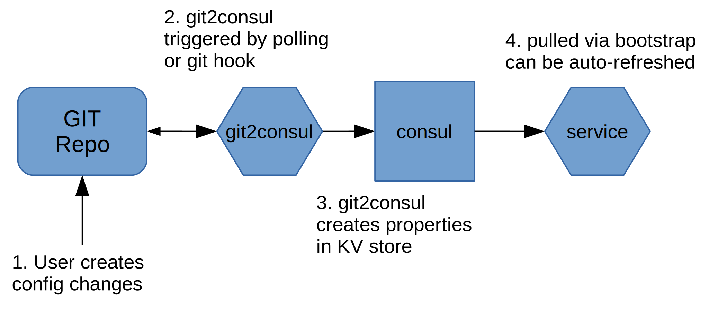
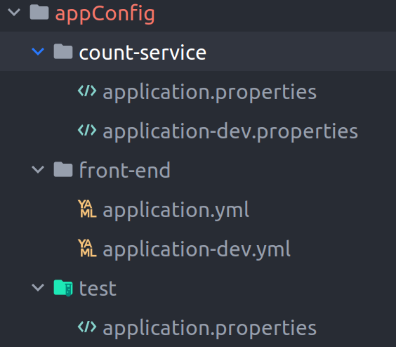
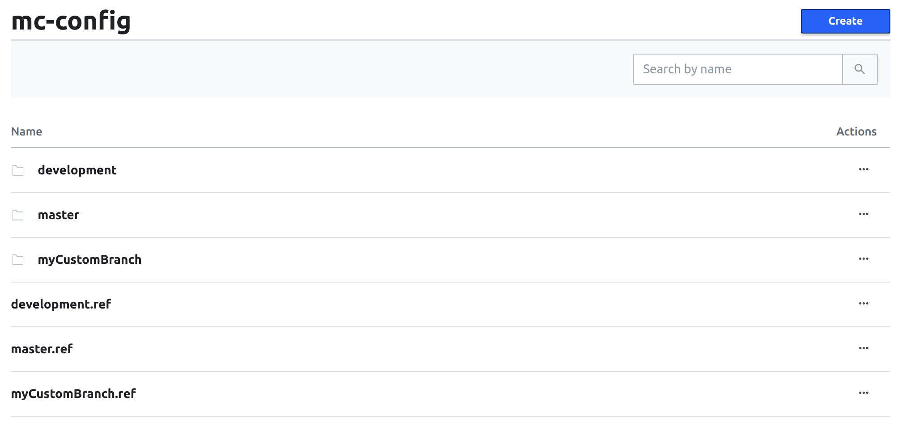
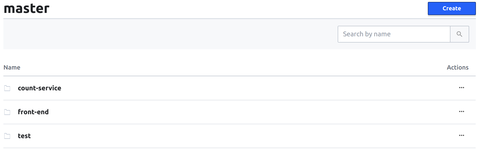
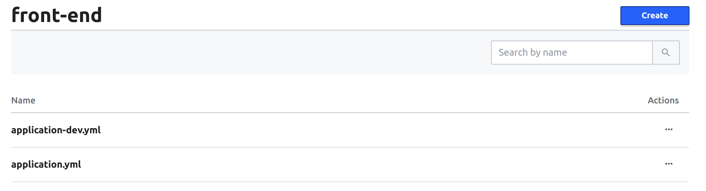
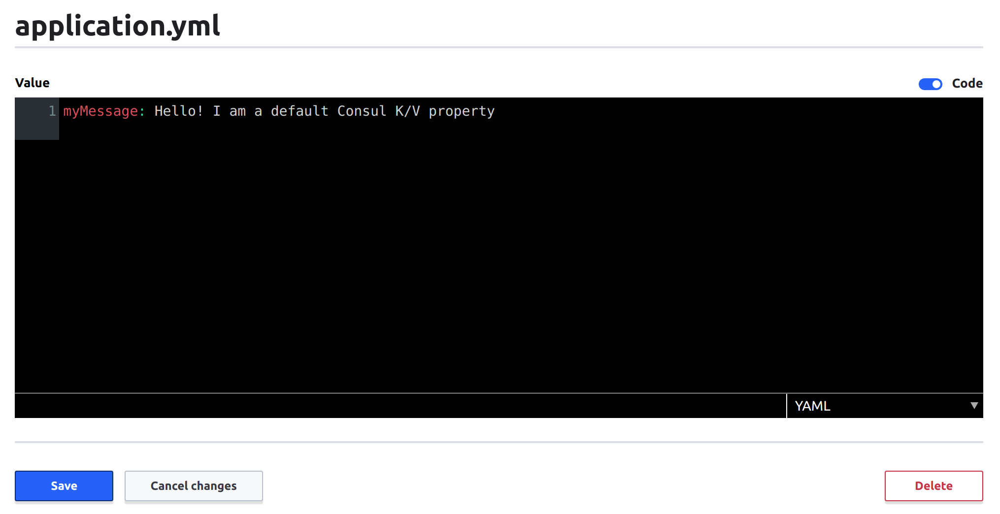
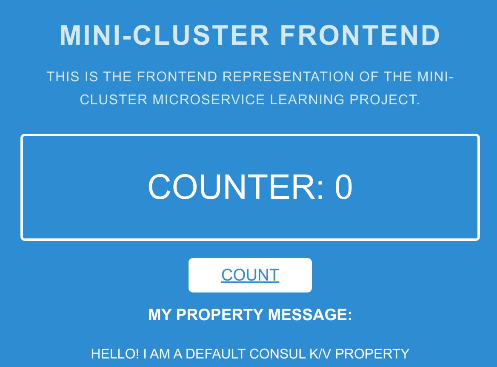

# Distributed Configuration Management

The second cool feature we can use is Consul distributed configuration management tooling.


Configuration management as a term can be confusing. Let's clarify
a bit. I think most people who are familiar with DevOps will probably think
of one of the big three _configuration management tools_:

 - __Ansible__
 - __Chef__ 
 - __Puppet__
 
Indeed, all of these tools can be used to solve the problems of configuration 
management, however all of these seem to take an _infrastructure_ focused approach, 
while _Consul's_ configuration solution is _application_ focused. In fact, we will probably use
a combination of both technologies to give us flexability.

This writeup will explore how to do _application_ configuration management using versioned configuration
using `git` + `consul` + `spring-consul-config`.

#### Some of the goals we want from a configuration standpoint:
1. Configuration changes should be version controlled: _We want
to be able to track when configuration changes where made and by whom and have the human review process._
2. Configuration changes should happen without re-deploying the service: _The point
of making something configurable is allow changes to the operation of the service without code
changes. If we can get low-impact config changes it will allow us to do feature flags easily with low impact.
3. Configuration should be hierarchical: _Properties should be set by the most specific config
to the least specific and have sane defaults._
4. Configuration Profiles should be able to be mixed and matched: _This allows us to do feature flags gives us flexability._


# Configuration Property Management Example

We want to show a value on the front end. This value will be configured as an application property. We are going to 
start super simple and place an application configuration property that gets rendered as part of the front-end.

## The Most Basic Approach

To start lets take the most basic approach to setting a configuration property inside Spring. First let's add the a property
to our `application.properties` file. 

```properties
...
myMessage=Hello! I am property!
```

I added a html element to the _Thymeleaf_ template that looks for a message:
```html
...
    <h3 style="color: white;">My Property Message:</h3>
    <p style="color: white;" th:text="${myMessage}"></p>
...
```

Finally, I used the `@Value` annotation with the property injection syntax.
```java
public class FrontendController {
    ...
    @Value("${myMessage}")
    private String myMessage;

    ...
    @GetMapping("/")
    public String launch(@RequestParam(name = "name", required = false, defaultValue = "World") String name, Model model) {
        ...
            model.addAttribute("myMessage", myMessage);
        ...
    }
```

Now when we run the application we can see our configured property.


_Hello, property! I am human! We can be friends!_

We have gained a small bit of flexibility in our front-end. Now we don't need to make any code changes to change
our message. Using Spring's configuration properties we can now pass in new values on start-up.

Here is an example using the _Spring Boot Maven Plugin_:

```bash
./mvnw spring-boot:run -Dspring-boot.run.arguments=--myMessage="I was passed in at startup"
```

A good first start, but this method has a few problems. First, this method becomes unwieldy after only
a few different configuration properties start needing to be passed in. Second, configuration changes
are not version controlled so changes are not audible. Third, this method isn't suited for sensitive values
as it can leak them into logs. Lastly, we still basically need to restart the app to make configuration changes.

Let's see if we can do a bit better.

## Enter Consul K/V Store Dynamic Configuration Management
We already talked about the [service discovery features of Consul](consul-presentation-outline.md), but another key
feature the Consul provides us is a distributed Key/Value store. We can leverage this functionality to
give us dynamic property management. 

Spring Boot will pull these properties from the Consul server on start-up and can update them while running, which is
where the term _dynamic_ comes from. In our example, we will be using a `git` repository to provide tracking and 
audibility of our properties and a companion service called `git2consul` that makes sure that changes to the repository
are populated to Consul.


 
### Dynamic Configuration in Action

Since _Spring Boot_ is awesome it has a library that allows us to easily integrate with Consul KV store
to do a dynamic configuration. For our example, lets make the configuration property `myMessage` that we defined in the
simple example a dynamic property that is version controlled in a GIT repository an is automatically refreshed upon update.

Step one is to add the Spring Cloud Consul Config library into our front-end application:
```xml
<!-- Front-End pom.xml -->
...
<dependency>
    <groupId>org.springframework.cloud</groupId>
    <artifactId>spring-cloud-starter-consul-config</artifactId>
    <version>2.2.0.RELEASE</version>
</dependency>
...
```

Great! Now we need to set up the configuration to pull from Consul. If you are familiar with _Spring_ you might wonder
how do remote properties work if you need them to initialize beans. Spring solves this with a special configuration file
called `bootstrap` (.yml or .properties). The `bootstrap` file gets executed earlier on in the Spring Context initialization
process and allows initialization with a remote configuration.

In addition, I have switched the _front-end service_ configuration to __YAML__ files instead of __.properties__. YAML 
is easier to read and displays better in the Consul UI, although all of this will work with property files as well.

```yaml
# front-end application.yml
myMessage: Hello! I am a local property
```
We will keep a local copy of the properties in case you want to run the application 
with remote configuration disabled. (_Set `enabled` to false_)

You will also notice that we move the _Consul Service Discovery_ out into bootstrap as well.

```yaml
# front-end bootstrap.yml
spring:
  application:
    name: front-end
  cloud:
    consul:
      host: localhost
      port: 8500
      config:
        enabled: true
        format: FILES
        prefix: mc-config/master/front-end
```

Before we talk about what `format` and `prefix` mean. We need to talk about our configuration 
of git2consul.

```json
// git2Consul Configuration
{
  "version": "1.0",
  "repos": [
    {
      "name": "mc-config",
      "url": "/var/repo",
      "branches": [
        "master",
        "development",
        "myCustomBranch"
      ],
      "hooks": [
        {
          "type": "polling",
          "interval": "1"
        }
      ]
    }
  ]
}
```
In this example I have set a simple local repo with three folders:

git2Consul will poll the repo every minute and update generate the kv-store.

This is what git2Consul generates first from branches:

Then via folders

Finally each configuration file:

We can even open / edit the config file in the Consul UI:


As you can see the `prefix:` variable is the Consul KV path to the configuration location
for this application. `format: FILES` tells the _Spring Cloud Consul Config_ library to parse a config
file instead of a grouping of K/V pairs. I believe this is a cleaner way of storing
configuration.

That's IT! All we need to do is start the application and our configuration will be dynamically pulled
from Consul.



### Automatic updates on config changes
Woo! Our app is pulling our version controlled configs automatically. However, updates won't be realized
until application restart. Bummer, especially if you want to use feature flags to turn things on and off.

Luckly, Spring provides a easy solution. All you need to do is mark the bean with configuration values as refreshable
using `@RefreshScope`.

```java
// FrontendController.java
...

@Controller
@RefreshScope
public class FrontendController {
    ...
    @Value("${myMessage}")
    private String myMessage;
    ...
```

By default, _Spring Cloud Config Consul_ automatically watches for configuration changes and refreshes
will refresh the bean contexts. 

You can turn this off using:
```properties
spring.cloud.consul.config.watch.enabled = false
``` 

With this off you can trigger a bean context refresh using the actuator endpoint:
`/actuator/refresh`
    
### STRETCH GOALS
- Add database connection to count service.
- Set up service discovery for Database using Consul.
- Vault as secret store
- Set up vault to dynamically create logins for service. 