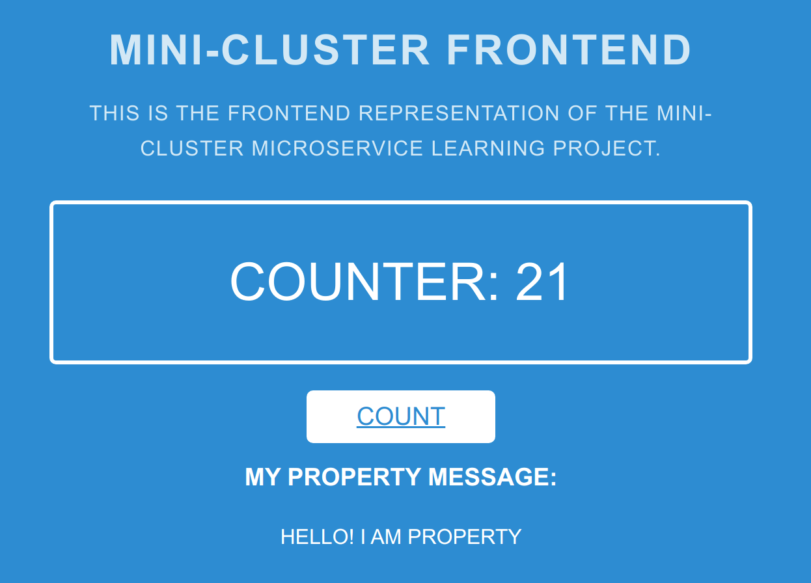

# Distributed Configuration Management

The second cool feature we can use is Consul distributed configuration management tooling.


Configuration management as a term can be confusing. Let's clarify
a bit. I think most people who are familiar with DevOps will probably think
of one of the big three _configuration management tools_:

 - __Ansible__
 - __Chef__ 
 - __Puppet__
 
Indeed, all of these tools can be used to solve the problems of configuration 
management, however all of these seem to take an _infrastructure_ focused approach, 
while _Consul's_ configuration solution is _application_ focused. In fact, we will probably use
a combination of both technologies to give us flexability.

This writeup will explore how to do _application_ configuration management using versioned configuration
using `git` + `consul` + `spring-consul-config`.

#### Some of the goals we want from a configuration standpoint:
1. Configuration changes should be version controlled: _We want
to be able to track when configuration changes where made and by whom and have the human review process._
2. Configuration changes should happen without re-deploying the service: _The point
of making something configurable is allow changes to the operation of the service without code
changes. If we can get low-impact config changes it will allow us to do feature flags easily with low impact.
3. Configuration should be hierarchical: _Properties should be set by the most specific config
to the least specific and have sane defaults._
4. Configuration Profiles should be able to be mixed and matched: _This allows us to do feature flags gives us flexability._


# Configuration Property Management Example

We want to show a value on the front end. This value will be configured as an application property. We are going to 
start super simple and place an application configuration property that gets rendered as part of the front-end.

## The Most Basic Approach

To start lets take the most basic approach to setting a configuration property inside Spring. First let's add the a property
to our `application.properties` file. 

```properties
...
myMessage=Hello! I am property!
```

I added a html element to the _Thymeleaf_ template that looks for a message:
```html
...
    <h3 style="color: white;">My Property Message:</h3>
    <p style="color: white;" th:text="${myMessage}"></p>
...
```

Finally, I used the `@Value` annotation with the property injection syntax.
```java
public class FrontendController {
    ...
    @Value("${myMessage}")
    private String myMessage;

    ...
    @GetMapping("/")
    public String launch(@RequestParam(name = "name", required = false, defaultValue = "World") String name, Model model) {
        ...
            model.addAttribute("myMessage", myMessage);
        ...
    }
```

Now when we run the application we can see our configured property.



_Hello, property! I am human! We can be friends!_

We have gained a small bit of flexibility in our front-end. Now we don't need to make any code changes to change
our message. Using Spring's configuration properties we can now pass in new values on start-up.

Here is an example using the _Spring Boot Maven Plugin_:

```bash
./mvnw spring-boot:run -Dspring-boot.run.arguments=--myMessage="I was passed in at startup"
```

A good first start, but this method has a few problems. First, this method becomes unwieldy after only
a few different configuration properties start needing to be passed in. Second, configuration changes
are not version controlled so changes are not audible. Third, this method isn't suited for sensitive values
as it can leak them into logs. Lastly, we still basically need to restart the app to make in configuration changes.

Let's see if we can do a bit better.

## Enter Consul K/V Store Dynamic Configuration Management
We already talked about the [service discovery features of Consul](consul-presentation-outline.md), but another key
feature the Consul provides us is a distributed Key/Value store. We can leverage this functionality to
give us dynamic property management. 

Spring Boot will pull these properties from the Consul server on start-up and can update them while running, which is
where the term _dynamic_ comes from. In our example, we will be using a `git` repository to provide tracking and 
audibility of our properties and a companion service called `git2consul` that makes sure that changes to the repository
are populated to Consul.
 
// TODO: Create Diagram of GIT + GIT2CONSUL + CONSUL + SERVICE


### OUTLINE

- Define the example scenario.
- Show the basic solution with application.properties.
- Show how version control gets populated to consul via git2consul.
- Show how using spring actuator you can do a manual refresh of the config property.
- Show how to do automatic config refreshes using _config watch_ turned on.
- Consul as distributed configuration management.
- Dynamic
- Vault as secret store
    - Dynamically allocated database connections.
    
### STRETCH GOALS
- Add database connection to count service.
- Set up service discovery for Database using Consul.
- Set up vault to dynamically create logins for service. 