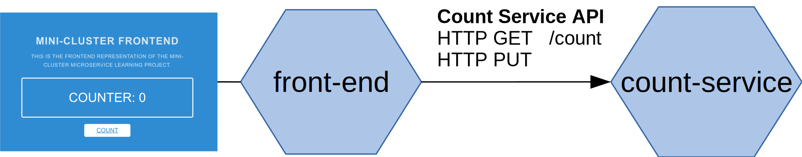
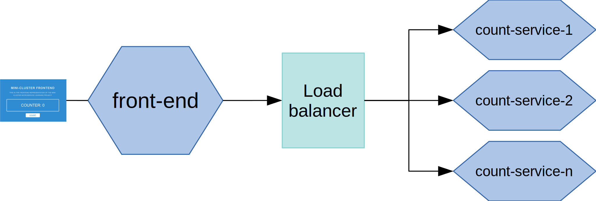
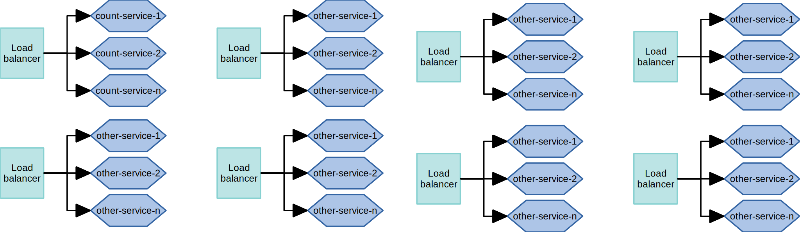

# Why Consul

The purpose of this project is to show by example, step-by-step, what Consul does, why
we might use it, and how we can create a compelling development story when working in a microservice
architecture. 

## The Starting Point: A Naive Microservice Architecture
The starting point of our story is the extremely simple application, a counter. 
Click a button, and the number increases. The application is made up of two services.
- A _front-end_ service builds the model and renders the count splash page. The
_front-end_ microservice has a dependency on a _count-service_ API. 
The _front-end_ service exposes a count endpoint which when called triggers the process 
to increase the counter. 
- The _count-service_ exposes a REST API that consists of one resource: __count__ and
two methods `GET` current count value and `PUT` a new count value.


_Naive count application microservice architecture._

Currently, the dependency for the connection between the _front-end_ and _count-service_
is pulled in as configuration. These are passed in during service startup as
environment variables.

```yaml
# From docker-compose to simulate different network nodes.

# Front-end environment configuration
...
environment:
  SERVICE_COUNT_HOST: "http://count-service"
  SERVICE_COUNT_PORT: 8081
...
```

This works and is deployable. However, functionality is dependent on both services
being available. They are still coupled together. We also can't fully take advantage of the 
abstraction that the __RESTful__ API gives us. For example, if _count-service_ when down for 
some reason, maybe the node crashed, front-end wouldn't be able to provide the counting
functionality until count-service was restarted. The solution to this insert another layer of
abstraction between the services.

### Enter the Load-balancer
A common and traditional solution to this is to use a program called a load-balancer.
In its most basic form, a load balancer is a program that acts as an _proxy_ between services.
It exposes a single address that when hit will route requests to downstream services. It can use different
algorithms to choose which downstream service instance to route a request two. For example,
a simple algorithm _round robin_ counts the number of instances configured and iterates each request to the next instance.



There are __four__ main things that a load balancer abstraction can provide:
1. __Balancing Load:__ The titular feature is to balance many simultaneous requests across different 
instances to keep response time (latency) low for a good user experience.
2. __Fault Tolerance__: If a node fails, request flow is not blocked. Load balancers usually have the ability
to check the registred services is up or down. This is called a _health check_. If a registered service's _health check_
fails the load balance will not route any more requests to it. This make our servers much more robust.
3. __Service Discovery:__ The load balancer provides a single endpoint that can represent multiple instances
of a service, therefore services that have a dependency on the configured service can use the static endpoint to represent 
the dependency without worring about the specific network location.
4. __Access Control:__ Some services should only have the ability to talk to other services. This was traditionally done by
IP restrictions. Since the load balance provides a single static IP this makes the configuration easier.

### Load Balance Limitations
Load Balancers are a good solution when you have a smaller about of services and where generally
designed for static environments. Once you start scaling out to a higher quantity of services there a signifcant
performance cost increase and configuration complexity.

The configuration complexity of adding new services to the 
load balancer's configuration also increases and as services start becoming more dynamic and transient (i.e turning on and
off more often) this configuration overhead becomes harder to manage. This also effects security, as using 
identity based service names make scaling rules much easier.

In addition, a load balancer itself becomes a single point of failure and a potential bottleneck.

__Load Balancer's allow for some dynamic abstraction of services but in the end are
still based on *static host based networking.*__

## Enter Consul
Consul basically solves all the same problems that load balances do, but in a dynamic environment.


