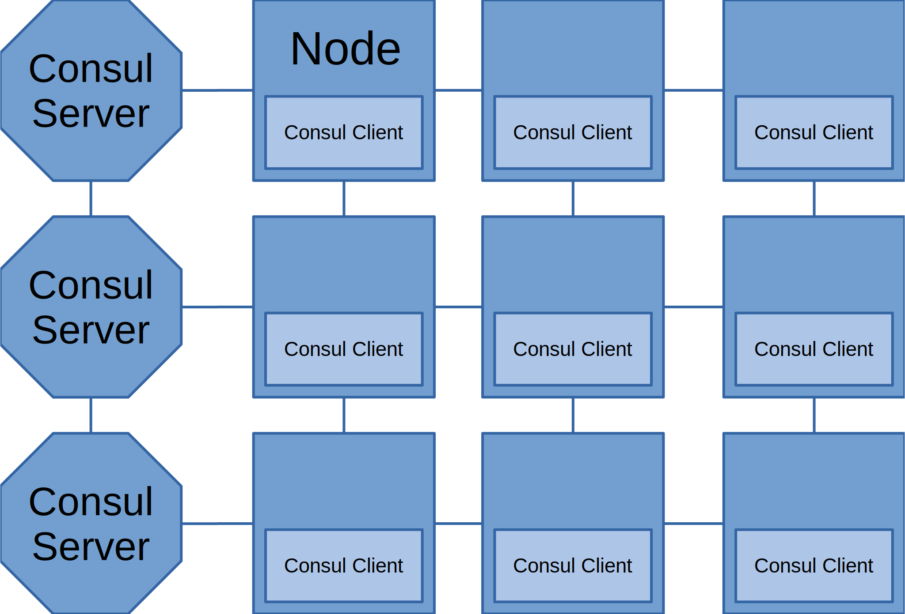
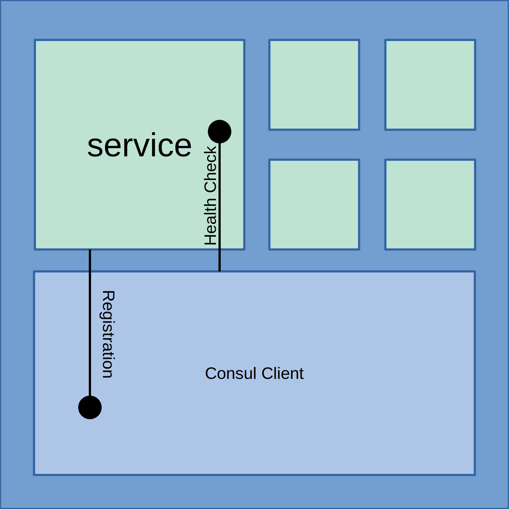
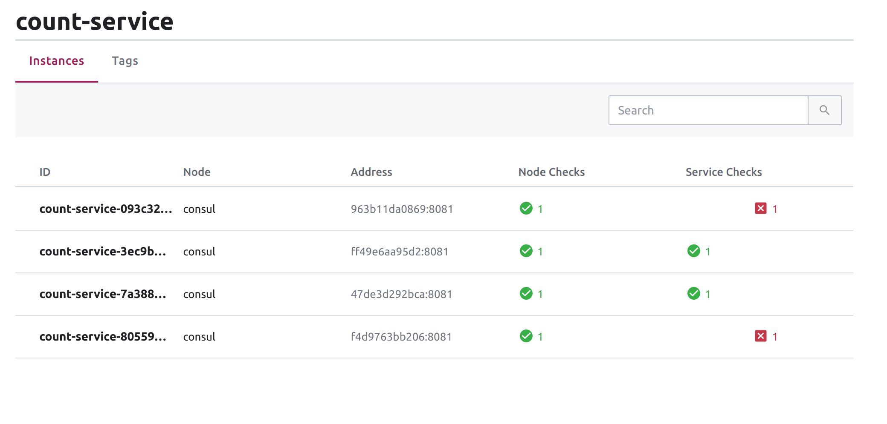

# Why Consul

The purpose of this project is to show by example, step-by-step, what Consul does, why
we might use it, and how we can create a compelling development story when working in a microservice
architecture. 

## The Starting Point: A Naive Microservice Architecture
The starting point of our story is the extremely simple application, a counter. 
Click a button, and the number increases. The application is made up of two services.
- A _front-end_ service builds the model and renders the count splash page. The
_front-end_ microservice has a dependency on a _count-service_ API. 
The _front-end_ service exposes a count endpoint which when called triggers the process 
to increase the counter. 
- The _count-service_ exposes a REST API that consists of one resource: __count__ and
two methods `GET` current count value and `PUT` a new count value.


Currently, the dependency for the connection between the _front-end_ and _count-service_
is pulled in as configuration. These are passed in during service startup as
environment variables.

```yaml
# From docker-compose to simulate different network nodes.

# Front-end environment configuration
...
environment:
  SERVICE_COUNT_HOST: "http://count-service"
  SERVICE_COUNT_PORT: 8081
...
```

This works and is deployable. However, functionality is dependent on both services
being available. They are still coupled together. We also can't fully take advantage of the 
abstraction that the __RESTful__ API gives us. For example, if _count-service_ when down for 
some reason, maybe the node crashed, front-end wouldn't be able to provide the counting
functionality until count-service was restarted. The solution to this insert another layer of
abstraction between the services.

### Enter the Load-balancer
A common and traditional solution to this is to use a program called a load-balancer.
In its most basic form, a load balancer is a program that acts as an _proxy_ between services.
It exposes a single address that when hit will route requests to downstream services. It can use different
algorithms to choose which downstream service instance to route a request two. For example,
a simple algorithm _round robin_ counts the number of instances configured and iterates each request to the next instance.


There are __four__ main things that a load balancer abstraction can provide:
1. __Balancing Load:__ The titular feature is to balance many simultaneous requests across different 
instances to keep response time (latency) low for a good user experience.
2. __Fault Tolerance__: If a node fails, request flow is not blocked. Load balancers usually have the ability
to check the registered services is up or down. This is called a _health check_. If a registered service's _health check_
fails the load balance will not route any more requests to it. This make our servers much more robust.
3. __Service Discovery:__ The load balancer provides a single endpoint that can represent multiple instances
of a service, therefore services that have a dependency on the configured service can use the static endpoint to represent 
the dependency without worring about the specific network location.
4. __Access Control:__ Some services should only have the ability to talk to other services. This was traditionally done by
IP restrictions. Since the load balance provides a single static IP this makes the configuration easier.

### Load Balance Limitations
Load Balancers are a good solution when you have a smaller amount of services and where generally
designed for static environments. Once you start scaling out to a higher quantity of services there a signifcant
performance cost increase and configuration complexity.


The configuration complexity of adding new services to the 
load balancer's configuration also increases and as services start becoming more dynamic and transient (i.e turning on and
off more often) this configuration overhead becomes harder to manage. This also effects security, as using 
identity based service names make scaling rules much easier.

In addition, a load balancer itself becomes a single point of failure and a potential bottleneck.

__Load Balancer's allow for some dynamic abstraction of services but in the end are
still based on *static host based networking.*__

## Enter Consul
Consul basically solves all the same problems that load balances do, but designed around the idea of dynamic
infrastructure. Consul is a small program that provides that runs as an agent service on all the nodes you
want to be part of your cluster. There are two modes of operation that Consul can run in: __server__ and __client__ modes.




Consul __server__ agents are responsible for choosing a leader and persisting the _service registery_. Consul __clients__ 
register services, run health checks and forward queries to the servers. 

The nodes talk to each other using a special _gossip_ protocol which allows for distributed node discovery. Meaning 
each node is responsible for checking and tracking other nodes, making the network super robust. If a node fails all the 
other nodes will propagate that failure across all the nodes automatically.

To join a new node to the cluster all that needs to happen is have the Consul _client_ on the new node chat to a running
consul server, and it will automatically propagate across the network.

## Registering A Service
When you start up your service on a node the service will register itself with the running Consul client. Consul provides
a couple of ways to do this, including a configuration file that the consul client can read. In addition, the service can
also register itself via Consul's REST API. Which works well for dynamic service registration.



As part of the services' registration process, a _health-check_ endpoint is configured. The Consul Client will automatically 
start pinging the service's _health-check_ endpoint to report the health status of that service to the cluster. The service


## Code Example

This section will show how I implemented the service discovery with consul in this project. Using the _spring-cloud-consul-discovery_
library.

__Dependency In Maven__
```xml
<dependency>
    <groupId>org.springframework.cloud</groupId>
    <artifactId>spring-cloud-starter-consul-discovery</artifactId>
    <version>2.2.0.RELEASE</version>
</dependency>
```

This dependency basically provides tools that allow a spring boot service to automatically 
register itself on startup with Consul and a discovery client for automatically discovering 
dependent services.

__Spring Application Configuration For Consul__
```properties
spring.application.name=count-service
spring.cloud.consul.host=localhost
spring.cloud.consul.port=8500
``` 

All we are doing here is setting the host and the port of the Consul Client we wish to connect to.
The `spring.application.name` property is used as the registered service name in Consul and is the ID
 that other services use to discover the service from Consul. It is the abstract representation of
 a cluster of this service. 
 
In addition, if you want to run multiple instances of the same service on a single node.
You can provide an instance ID template like so: 
```
spring.cloud.consul.discovery.instanceid=${spring.application.name}:${random.value}
```

__Setting Up Health Checks__

Spring Boot and Consul Discovery library make this super easy as it works automatically with `Spring Boot Actuator`
all you need to do is bring it in as a dependency:
```xml
<dependency>
    <groupId>org.springframework.boot</groupId>
    <artifactId>spring-boot-starter-actuator</artifactId>
</dependency>
```

That is all the configuration need to automatically register your Spring Boot 
microservice with Consul. To see what this looks like, I snapped a screenshot
during the process of spinning up instances of the _count-service_. So that 
you can see what these services look like represented by in the UI.



### Using Service Discovery to make a REST call
Now that our microservices are registering themselves with Consul, let's resolve
a service ID to an actual address, so that our services can communicate.

Luckly the _spring-cloud-consul-discovery_ library provides everything we need.

Remember in the beginning of this write-up, our naive microservice implementation.
We statically configured the `count-service` hostname:port so that the rest call can be
constructed? Let's replace that with Consul __Service Discovery__!  

First at `@EnableServiceDiscoveryClient` to initialize the discovery client.
```java
@SpringBootApplication
@EnableDiscoveryClient
public class MiniClusterFrontEndApp { ... }
```

Now you can inject the `DiscoveryClient` into your services performing REST calls.

```java
// This method shows us how we can get the hostname from consul via "application-name"
public Optional<URI> serviceURL() {
    return discoveryClient.getInstances(COUNT_SERVICE_ID) // COUNT_SERVICE_ID = "count-service"
            .stream()
            .map(ServiceInstance::getUri)
            .findFirst();
}
```

Construct and execute the REST call:
```java
public Integer getCount() throws RestClientException, ServiceUnavailableException {
        // COUNT = "/count"
        var service = serviceURL().map(s -> s.resolve(COUNT)).orElseThrow(() -> generateException("GET", COUNT));
        var responseEntity = restTemplate.getForEntity(service, Integer.class);
        return responseEntity.getBody();
}
```

And that's pretty much it! For little effort you have now decoupled your service
calls that can resolve dynamically. This provides three of the mentioned features
of _load balancers_:
- Service Discovery
- Load Balancing
- Fault Tolerance

Hope this was helpful!